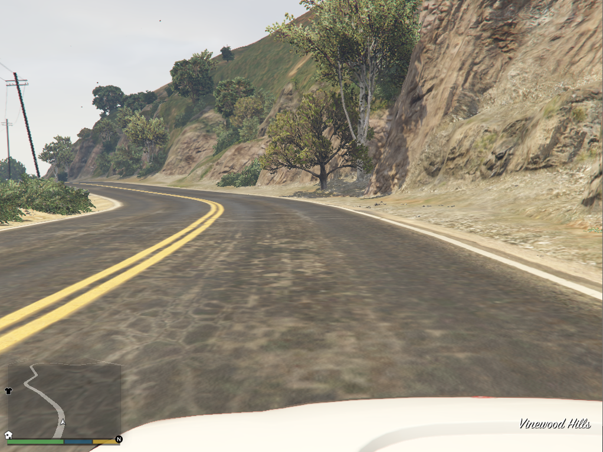
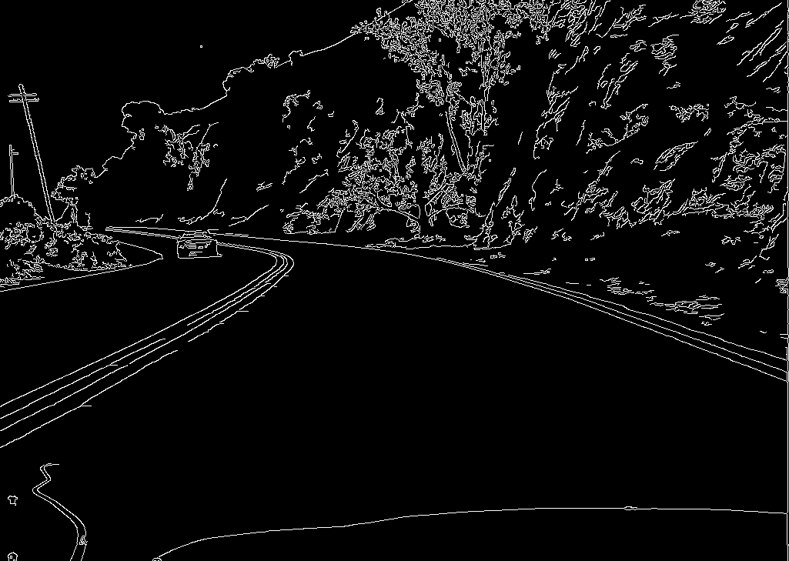
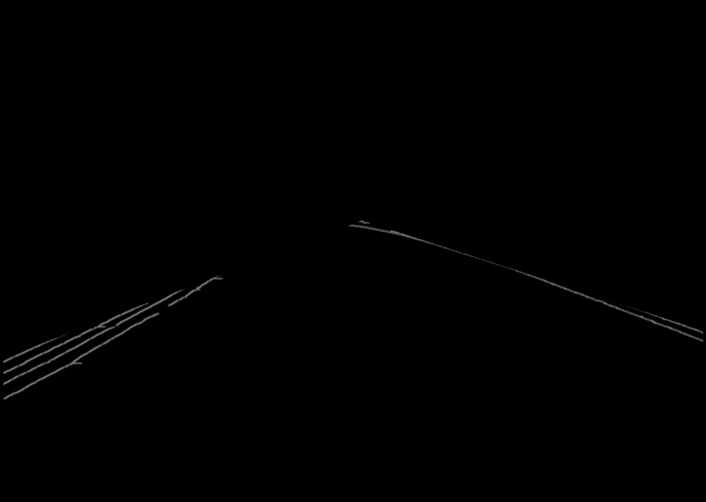
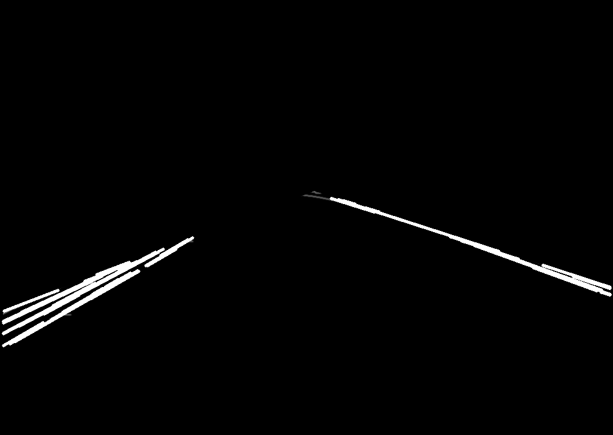

# AutoDrive
This project was to create an auto drive feature for a car in GTA V. This program detected lanes on either side of the car through GTA V's camera system. However, the actual auto drive was very limited due to the GTA roads and odd camera placement.

First, we took the image from the screen:

Second, we put it through a gray scale filter:

Third, through image processing like Hough Lines and Gaussian Blur we get:

Four, we found our lines from the image through stating our region of interest.

The result is this through averaging all our lines to find our two lanes. To get a more accurate read, the last ten lines detected are put into a queue and as soon as a new line is detected, it is added to the queue and the oldest is dequeued. and the result shown on the screen is an average of the latest ten lines.

The autodrive is still very limited and I plan to come back to this project in the future. Thank you PythonProgramming.net.
